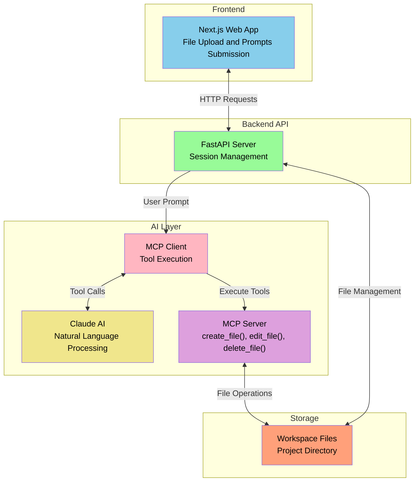

# AI Agent for File Editing

Application that allows users to upload a folder and use natural language prompts to perform filesystem operations (create, edit, delete). 

## Video Demo 
[Check out the demo on Youtube](https://youtu.be/XFnAwdAtG_k)

## Tech Stack

*   **Frontend**: Next.js
*   **Backend (API and MCP Client)**: FastAPI server that does two things:
    1.  Handles file uploads/downloads and user prompts.
    2.  Makes calls to the AI agent.
*   **MCP Server**: Python script that exposes filesystem tools (`create_file`, `edit_file`, `delete_file`) according to the MCP spec.
*   **LLM**: Claude API


## Architecture 



## Running the Application

### 1. Using Docker

- Prerequisites: Docker and Docker Compose should be installed.

1.  **Clone the repository:**
    ```bash
    git clone https://github.com/aditya-borse/mcp.git
    cd mcp
    ```

2.  **Create a .env file**
    ```bash
    cd server
    cp .env.example .env
    ```
    Fill in the values for the environment variables.

3.  **Build and run the containers:**
    ```bash
    cd ..
    docker compose up --build
    ```
    The application will be available at `http://localhost:3000`.

### 2. Manually 

1.  **Clone the repository:**
    ```bash
    git clone https://github.com/aditya-borse/mcp.git
    cd mcp
    ```

2.  **Create a .env file**
    ```bash
    cd server
    cp .env.example .env
    ```
    Fill in the values for the environment variables.

3.  **Install Backend Dependencies:**
    ```bash
    cd server
    python3 -m venv .venv # For Windows users: python -m venv .venv
    source .venv/bin/activate # For Windows users: .venv\Scripts\activate
    pip install -r requirements.txt
    ```

4.  **Install Frontend Dependencies:**
    ```bash
    cd frontend
    npm install
    ```

5.  **Start the Backend Server:**
    ```bash
    cd server
    uvicorn main:app --reload
    ```
    The backend will be available at `http://localhost:8000`.

6.  **Start the Frontend Server:**
    ```bash
    cd frontend
    npm run dev
    ```
    The frontend will be available at `http://localhost:3000`.

7.  **Use the Application:**
    Open `http://localhost:3000` in your browser, upload a `.zip` file, and start giving commands to the agent.